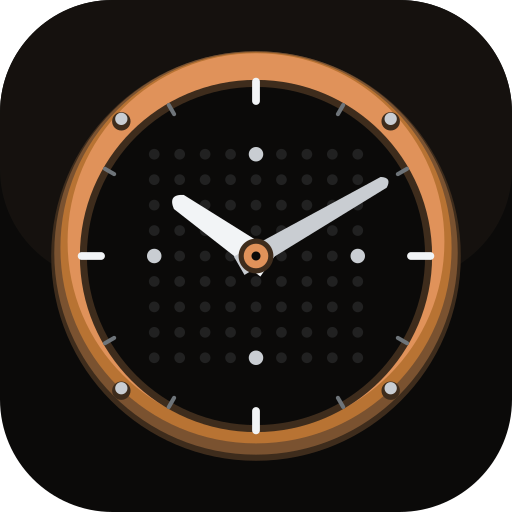
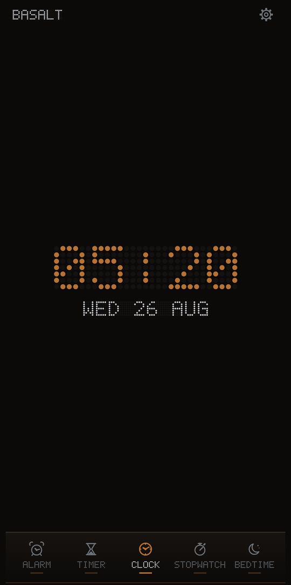
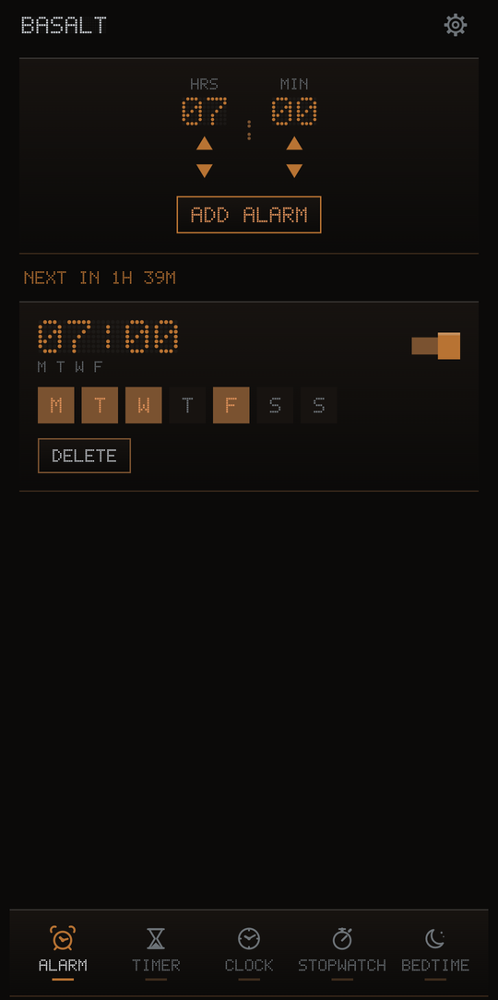
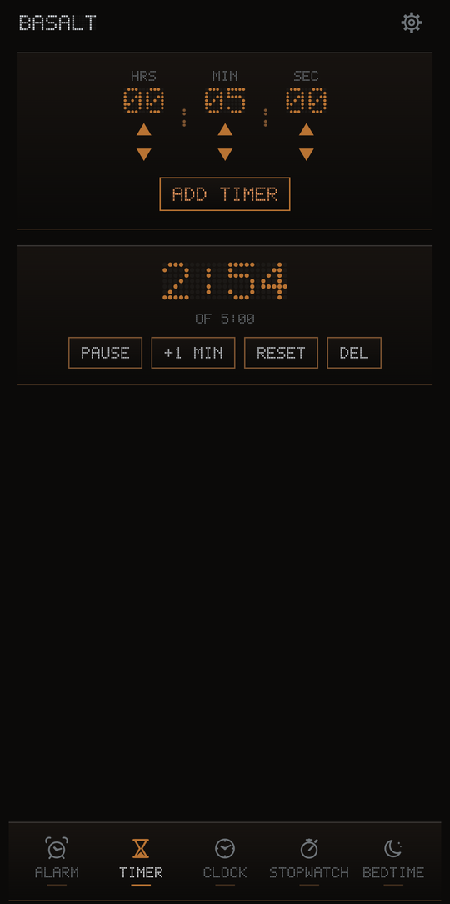
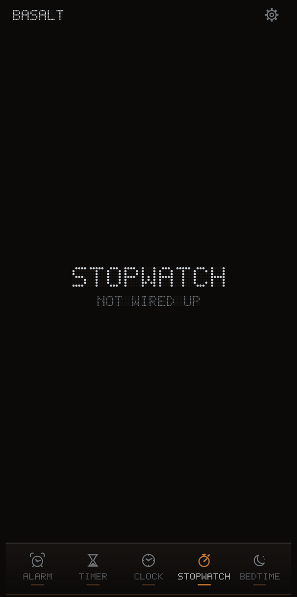
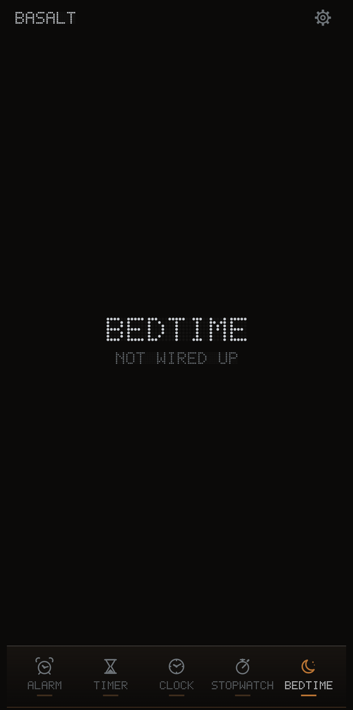
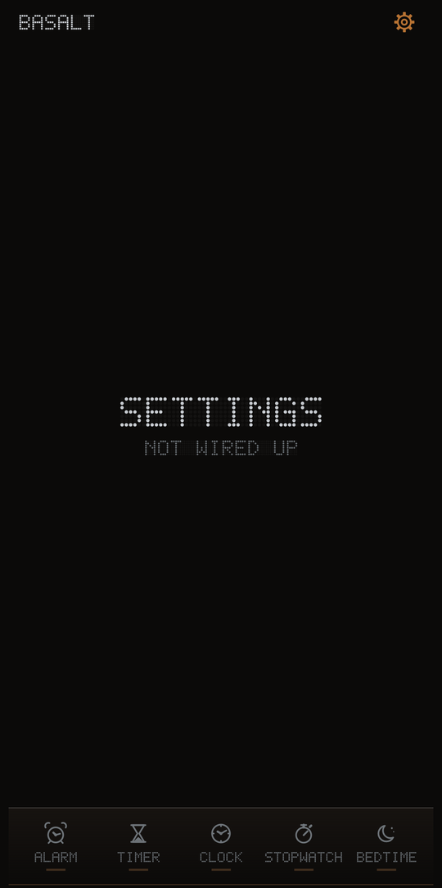
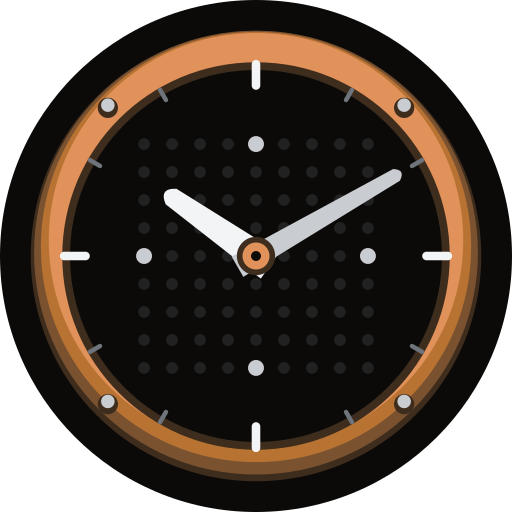

<p align="center">
  
</p>

<h1 align="center">Basalt</h1>

<p align="center">
  A clock for Android, rebuilt in Kotlin and Jetpack Compose.<br>
  Brass instrumentation housing a dot-matrix readout — no Material Design anywhere.
</p>

<p align="center">
  
  
  
  
</p>

---

## What this is

A ground-up recreation of the AOSP Clock (DeskClock), written in Kotlin with
Jetpack Compose, wearing a **Steam Age × Early Computing** face: silver, copper
and bronze chrome around a phosphor-style dot matrix.

The rule that shapes everything: **the metal is the chassis, the dot matrix is
the display.** Glyphs are always dots. Chrome is always metal. They never swap
roles.

There is no `androidx.compose.material` in this project. No `MaterialTheme`, no
`Scaffold`, no Material components, no Material icons, no ripples. Every button,
switch, stepper, icon and letterform is drawn from scratch on `foundation` +
`ui`. That is a deliberate cost, taken so the app looks like one machine rather
than a theme applied to someone else's.

> **Status: v0.1.0 — structural.** Clock, Alarm and Timer are wired up and
> working. Stopwatch, Bedtime and Settings are placeholders. Nothing is
> persisted across process death and **no alarm rings yet** — scheduling,
> notifications and the firing activity are the next pass. See
> [Roadmap](#roadmap).

---

## Screenshots

| Clock | Alarm | Timer |
|:---:|:---:|:---:|
|  |  |  |
| Live readout on the 5×7 matrix, ticking on minute boundaries | Repeat days, enable switch, time until the next alarm | Countdown that runs past zero, add-a-minute, per-timer controls |

| Stopwatch | Bedtime | Settings |
|:---:|:---:|:---:|
|  |  |  |
| Not built yet | Not built yet | Not built yet |

---

## The icon tells the time

<p align="center">
  
</p>

The launcher icon is not a picture of a clock — it *is* one. The adaptive icon's
foreground is a layer-list whose hour and minute hands are separate layers, and
the launcher activity declares `com.android.launcher3.HOUR_LAYER_INDEX` and
`MINUTE_LAYER_INDEX`. Launcher3 — and the OEM launchers derived from it, which
is most of them — finds those layers and rotates them about the icon's centre as
the clock advances.

The second hand is deliberately **not** animated (`SECOND_LAYER_INDEX = -1`): a
ticking second hand wakes the launcher every second for a detail nobody reads at
icon size.

Launchers that do not honour the convention, and anything pre-API-26, show a
static icon frozen at 10:10. That is an accepted degradation, not a guarantee.

The whole mark — bezel bands, etched ticks, rivets, dot dial, tapered hands — is
generated by [`tools/generate_icon.py`](tools/generate_icon.py) into SVG sources,
Android VectorDrawables and legacy mipmaps, so a palette change is a one-line
edit rather than an hour in an illustration tool.

---

## Design language

### Palette

| Token | | Hex | Role |
|---|---|---|---|
| `ink` |  | `#0B0A09` | Ground, unlit substrate |
| `ironOxide` |  | `#171310` | Panel base |
| `bronzeDeep` |  | `#3E2C1C` | Bezel shadow, engraved lines |
| `bronze` |  | `#7A5230` | Bezel body, dividers |
| `copper` |  | `#B87333` | Active accent, running timer |
| `copperHot` |  | `#E0925A` | Highlight, peak state |
| `patina` |  | `#4E7A6A` | Reserved for "elapsed / spent" |
| `silver` |  | `#C9CDD2` | Structural text, engraved labels |
| `silverBright` |  | `#F2F4F6` | Specular edge, focus ring |
| `pewter` |  | `#6E7479` | Unlit dots, disabled, ticks |
| `emberAlarm` |  | `#D0472B` | Firing alarm, destructive only |

Copper means *energised* — a running timer, an armed alarm, the selected tab.
Silver means *structural* — chrome, labels, information at rest. Never copper for
a plain label; never silver for a running state.

### Dot matrix

Glyphs are authored by hand, not shipped as a font: the renderer needs cell
coordinates, not outlines, so individual dots can be coloured and animated. A
glyph is written as an ASCII picture and folded to bitmasks once, at class-init:

```kotlin
'A' to Glyph.of(
    ".###.",
    "#...#",
    "#...#",
    "#####",
    "#...#",
    "#...#",
    "#...#",
)
```

Unlit cells are **drawn**, not skipped — the dark grid behind the message is as
much a part of the look as the message. Below about 2dp the cells switch from
round to square, because round dots turn to mush and square ones hold an edge.

Every matrix carries a plain-text `contentDescription`. The dots are a look, not
a barrier.

### Chrome

- **Bezel** — inset metal frame, drawn rather than nine-patched. Depth comes from
  a 1px bright top edge and a 1px dark bottom edge, never a blurred shadow: blur
  reads as glass, and this is milled brass.
- **Rivets, knurling, etched ticks** — the vocabulary that makes a panel a panel.
- **Icons** — six hand-drawn instruments: a bell with a striker, a dial, a
  sand-glass, a stopwatch with a crown, a crescent, a cog with real teeth.
- **Motion** — two curves only. `mechanicalStep` for anything discrete (a digit
  advancing) — fast in, hard stop, like a solenoid. `steamEase` for panels and
  reveals — slow start, long tail.

---

## Architecture

```
:app                 nav host, theme install, manifest
:core:design         palette, BezelPanel, controls, icon set, motion curves
:core:dotmatrix      Glyph, DotMatrixFont, DotMatrix / DotMatrixText renderers
:core:time           TimeSource, Weekdays, duration + clock formatting
:core:data           domain models, repository contracts, in-memory impls
:feature:alarm       alarm list + editor
:feature:clock       readout, world clock
:feature:timer       timer bank
:feature:stopwatch   stopwatch + laps
:feature:bedtime     sleep window
:feature:settings    settings surface
:widget              Glance widgets
```

Some load-bearing decisions:

- **Time is injected.** Nothing below the UI calls `System.currentTimeMillis()`
  at a call site; everything takes a `TimeSource`. Alarm scheduling, DST
  rollovers and timer expiry are untestable otherwise, and those are exactly the
  parts that have to be right.
- **Remaining time is derived, never decremented.** A timer stores a deadline on
  the monotonic clock, and the UI ticker exists only to trigger a redraw. A
  dropped tick loses nothing, and a timer that ran while the screen was off is
  correct the moment it is read again.
- **Alarms and their occurrences are separate types.** An `Alarm` is the rule; an
  `AlarmInstance` is one firing, with its own state machine. Snoozing a Tuesday
  cannot mutate the schedule.
- **Repositories are interfaces.** `BasaltRepositories` is the only file that
  names an in-memory implementation. When Room lands, that file changes and
  nothing above it does.

---

## Building

Requirements: **JDK 21** (AGP does not support 25 yet), Android SDK with
platform 36.

```bash
git clone <this repo> && cd Basalt
echo "sdk.dir=C:/path/to/Android/Sdk" > local.properties   # forward slashes
./gradlew assembleDebug
```

> `sdk.dir` must use forward slashes or escaped backslashes. A Windows path with
> single backslashes is silently mangled by the Java properties parser and
> surfaces as an unrelated-looking IO error.

### Release builds

Copy `keystore.properties.template` to `keystore.properties` and fill it in:

```properties
storeFile=keystore/basalt-release.jks
storePassword=…
keyAlias=basalt
keyPassword=…
```

Generate a keystore if you need one:

```bash
keytool -genkeypair -v -keystore keystore/basalt-release.jks -alias basalt \
        -keyalg RSA -keysize 4096 -validity 10000
```

CI can skip the file and set `BASALT_KEYSTORE`, `BASALT_KEYSTORE_PASSWORD`,
`BASALT_KEY_ALIAS`, `BASALT_KEY_PASSWORD` instead. With no configuration the
release build still succeeds — it just produces an unsigned APK and says so.

```bash
./gradlew assembleRelease
# app/build/outputs/apk/release/app-release.apk
```

The keystore and `keystore.properties` are git-ignored. They should stay that
way.

### Regenerating the icon

```bash
python -m pip install resvg-py
python tools/generate_icon.py
```

---

## Roadmap

### v0.1.0 — AOSP recreation *(in progress)*

Not trying to be special yet. The question is only: **can this be a reliable
Android clock?**

- [x] Module structure, design system, dot-matrix renderer
- [x] Navigation, live clock readout, launcher icon
- [x] Alarms — create, repeat days, enable, delete
- [x] Timers — countdown, pause/resume, add-a-minute, run past zero
- [ ] Stopwatch and laps
- [ ] Bedtime / sleep window
- [ ] Settings
- [ ] Persistence (Room + DataStore)
- [ ] **Alarm scheduling, notifications, and firing** — the actual boss fight
- [ ] Lifecycle: Doze, boot restore, timezone and DST changes, process death

Clock apps are deceptively evil. The UI is the easy part; "wake me at 6 AM after
Doze murdered everything" is the real work, and v0.1.0 is not finished until
that is proven.

### v0.2.0 — Themes and personality

Where it stops being "AOSP but in Kotlin".

- Steam Age and Early Computing as distinct, switchable themes
- The 7×13 hero glyph set and the 3×5 micro set
- Textures, materials, per-cell digit animation
- Custom clock faces

> AOSP Clock: *"Here is the time."*
> Basalt: *"Here is the time, displayed by a brass machine from an alternate 1980."*

### v0.3.0 — Widgets

The actual reason this project exists. Widgets are badly underused: most apps
ship one big clock and stop. The goal here is to treat widgets as a **design
system** — a modular renderer where a new style is a new configuration, not a
rewrite.

Planned: digital readout, brass analog, world board, next-alarm plate, timer
bank, stopwatch gauge, bedtime gauge, countdown-to-date, sun dial, compact
stack — across small, medium, large and ultra-wide.

Optional extras (weather, location) will be exactly that: **optional**, and
toggleable from Settings. Nothing reaches the network unless it is switched on.

### v1.0.0 — Release

---

## Licence

Basalt is released under the [MIT License](LICENSE).

It is an independent reimplementation. AOSP DeskClock (Apache 2.0) is used as a
**behavioural reference only** — for the semantics of alarm state machines,
timer overrun, lap arithmetic and world-clock time zones. No AOSP source is
copied into this repository.

- [NOTICES.MD](NOTICES.MD) — what is derived from where, and how
- [THIRD_PARTY_LICENSE.MD](THIRD_PARTY_LICENSE.MD) — full third-party licence texts

---

## Contact

<debadityamalakar@gmail.com>
